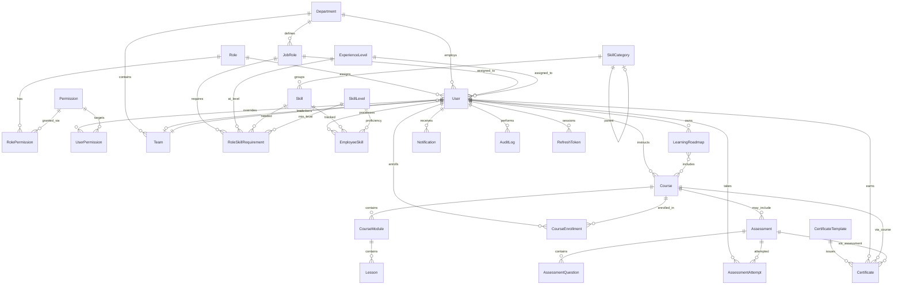
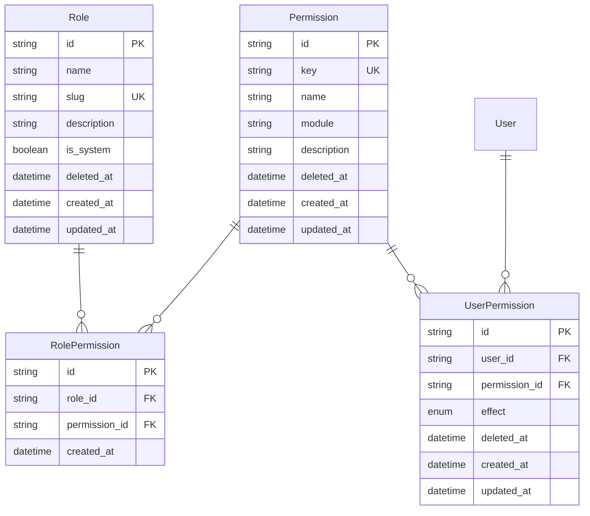
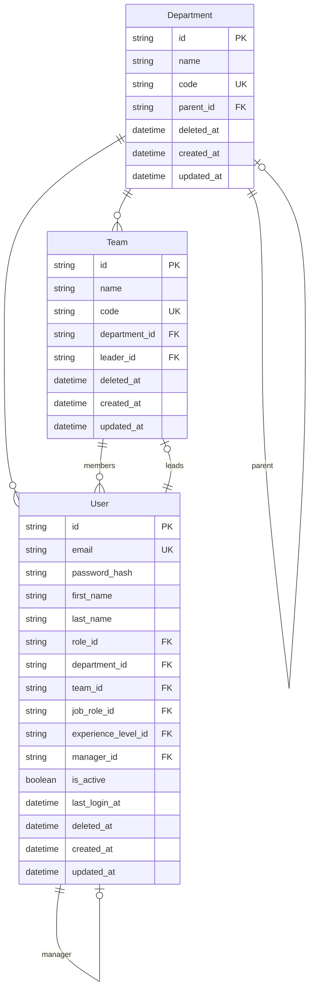
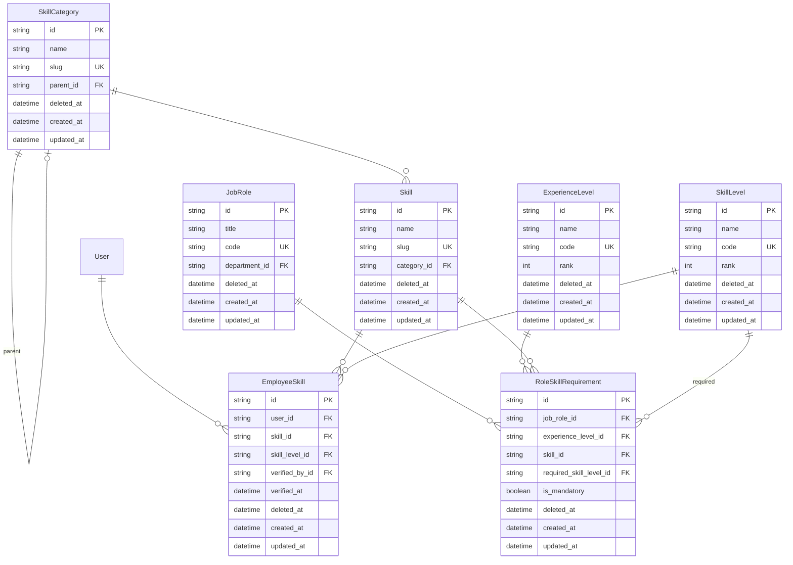
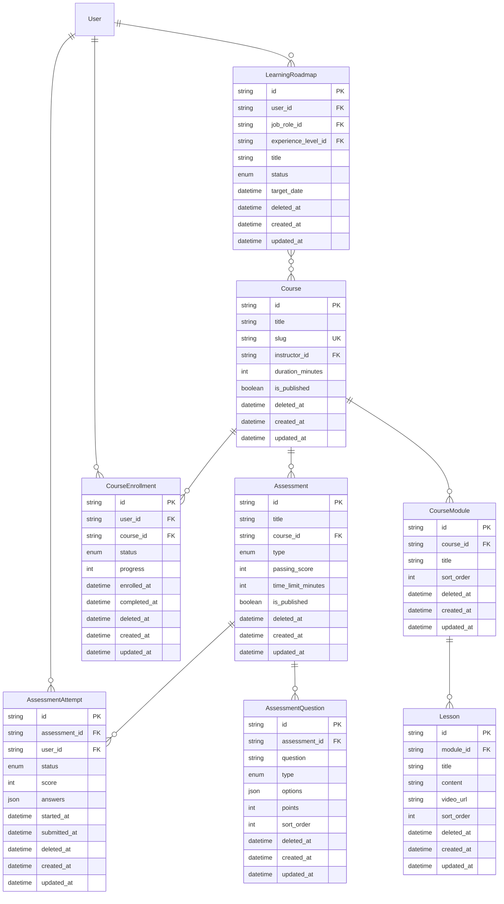
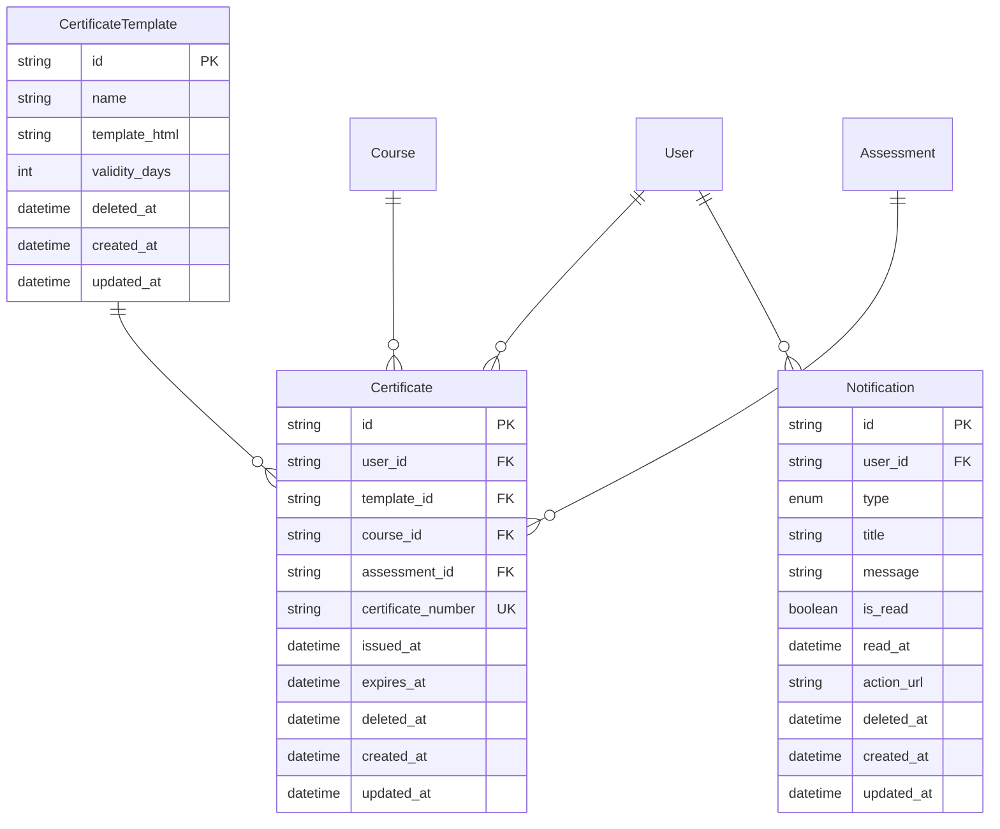
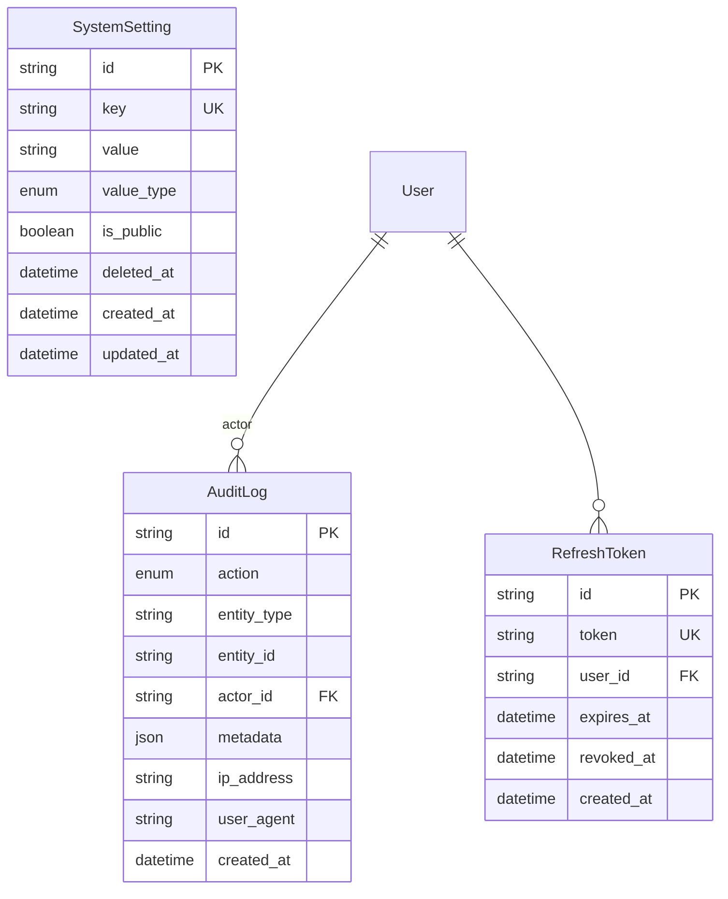

# TalentIQ — Entity Relationship Diagram

> PostgreSQL schema defined in [`prisma/schema.prisma`](../prisma/schema.prisma)

## Overview

The TalentIQ data model supports the full workforce intelligence lifecycle:

**Employee → Job Role → Experience Level → Required Skills → Learning Roadmap → Assessment → Certification → Promotion Readiness**

## High-Level Domain Map



## RBAC



| Constraint | Description |
|------------|-------------|
| `roles.slug` | Unique system role identifier (EMPLOYEE, ADMIN, etc.) |
| `permissions.key` | Unique permission key (e.g. `skills:read`) |
| `role_permissions(role_id, permission_id)` | Unique composite — no duplicate grants |
| `user_permissions(user_id, permission_id)` | Unique composite — one override per permission |

## Organization & Users



| Index | Columns |
|-------|---------|
| `users_email` | `email` |
| `users_role_id` | `role_id` |
| `users_department_id` | `department_id` |
| `users_deleted_at` | `deleted_at` |

## Career & Skills



| Constraint | Description |
|------------|-------------|
| `employee_skills(user_id, skill_id)` | One proficiency record per skill per employee |
| `role_skill_requirements(job_role_id, experience_level_id, skill_id)` | Unique skill requirement per role/level |

## Learning & Assessments



| Constraint | Description |
|------------|-------------|
| `course_enrollments(user_id, course_id)` | One enrollment per user per course |
| `courses.slug` | URL-safe unique identifier |

## Certifications & Notifications



## Audit & System



> **Note:** `AuditLog` is append-only (no `updated_at`, no soft delete) to preserve audit trail integrity.

## Soft Delete Strategy

Models with `deleted_at` support soft deletion:

| Domain | Models |
|--------|--------|
| RBAC | Role, Permission, UserPermission |
| Organization | Department, Team |
| Users | User |
| Career | JobRole, ExperienceLevel |
| Skills | SkillCategory, Skill, SkillLevel, EmployeeSkill, RoleSkillRequirement |
| Learning | Course, CourseModule, Lesson, LearningRoadmap, CourseEnrollment |
| Assessments | Assessment, AssessmentQuestion, AssessmentAttempt |
| Certifications | CertificateTemplate, Certificate |
| Notifications | Notification |
| System | SystemSetting |

Query pattern: `WHERE deleted_at IS NULL`

## Model Count

| Category | Models |
|----------|--------|
| RBAC | Role, Permission, RolePermission, UserPermission |
| Organization | Department, Team |
| Identity | User, RefreshToken |
| Career | JobRole, ExperienceLevel |
| Skills | SkillCategory, Skill, SkillLevel, EmployeeSkill, RoleSkillRequirement |
| Learning | Course, CourseModule, Lesson, LearningRoadmap, CourseEnrollment |
| Assessments | Assessment, AssessmentQuestion, AssessmentAttempt |
| Certifications | CertificateTemplate, Certificate |
| Notifications | Notification |
| System | AuditLog, SystemSetting |
| **Total** | **28 models** |

## Migrations

```bash
# Apply migrations
npm run db:migrate

# Seed reference data
npm run db:seed
```

Migration files are stored in [`prisma/migrations/`](../prisma/migrations/).
